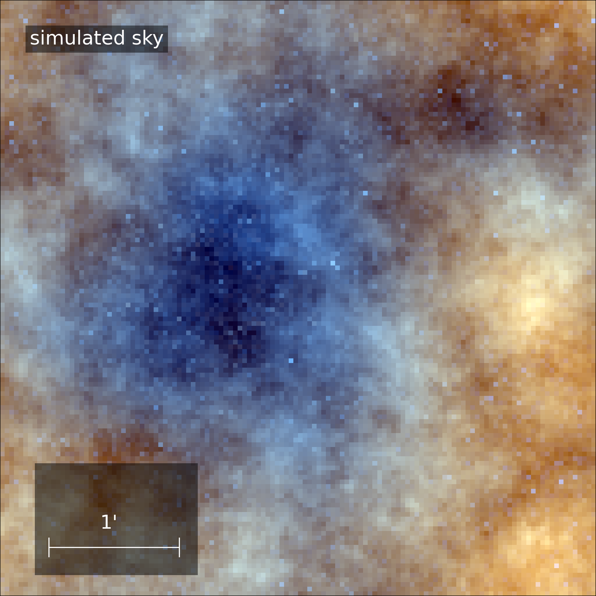
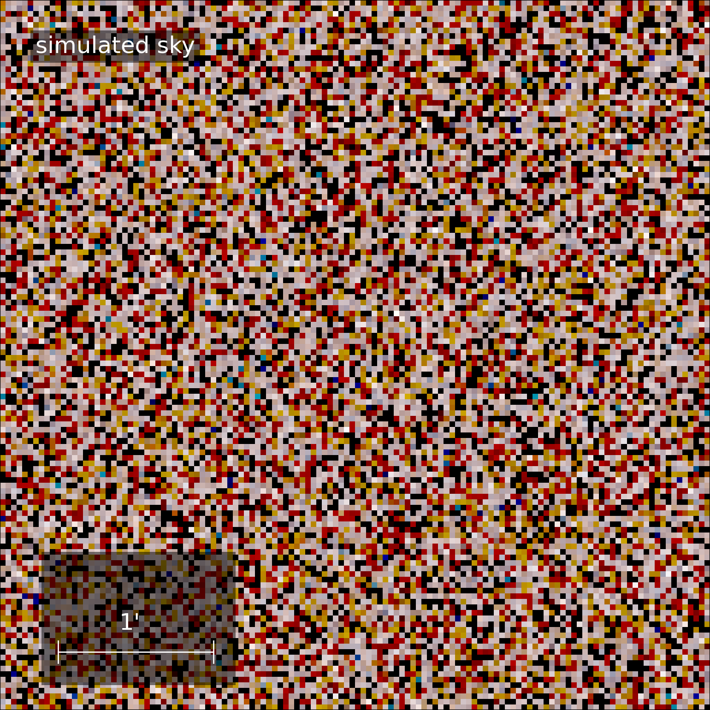
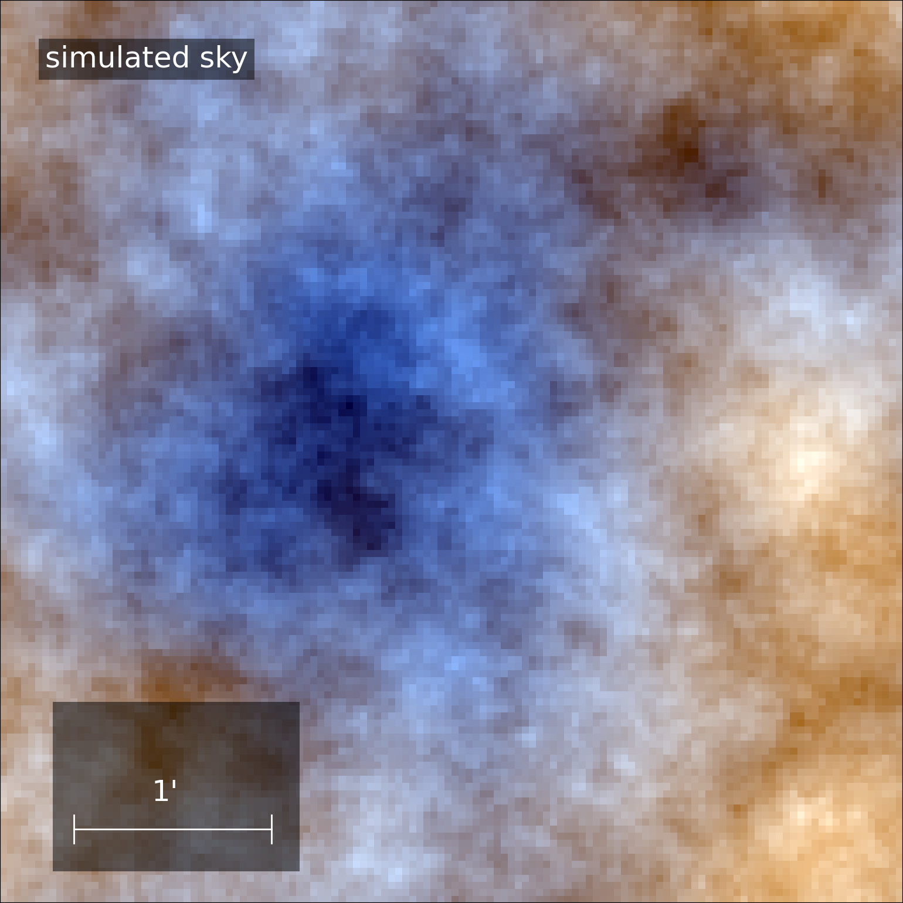
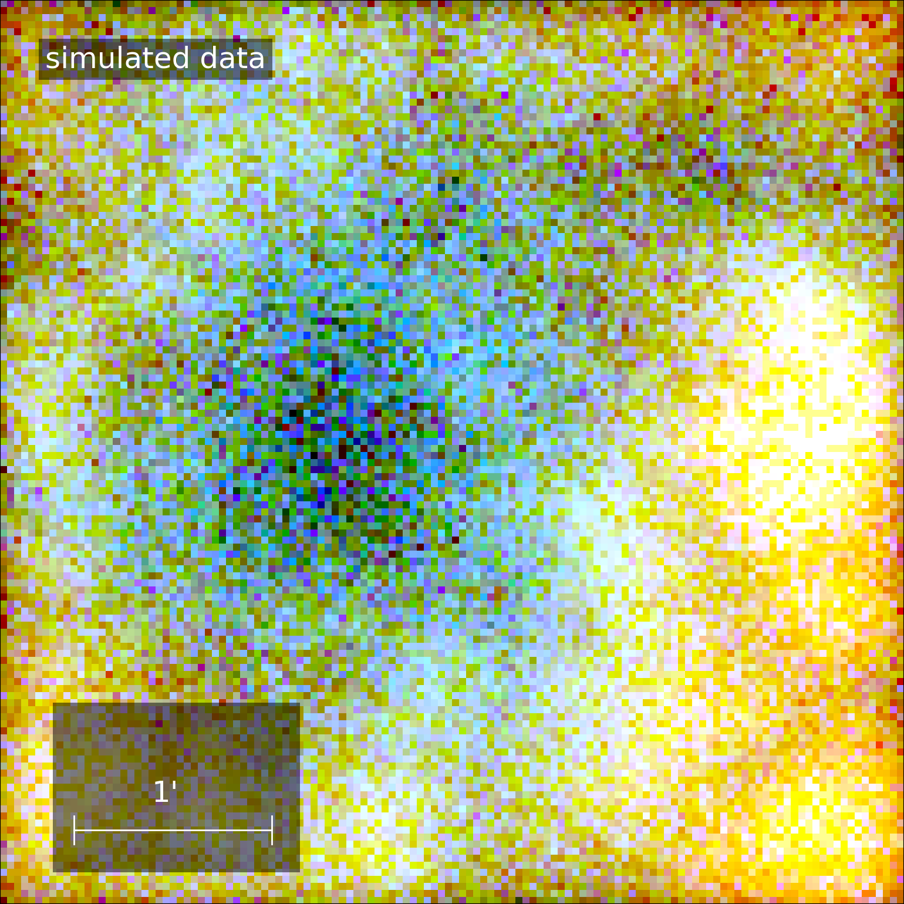

# Summary
Many advances in astronomy and astrophysics rely on accurately mapping sky emissions across various
wavelengths, which often requires reconstructing spatially and spectrally correlated signals from multiple
instruments. To facilitate this, we introduce a universal Bayesian imaging kit, a flexible and 
modular platform designed for high-fidelity Bayesian imaging. Specifically, we present J-UBIK, an 
implementation leveraging the JAX-accelerated NIFTy.re [@Edenhofer:2024] software as its backend.
J-UBIK streamlines the implementation of key Bayesian inference components, providing customizable 
likelihood models for different instruments and adaptable prior models for various applications.
The package includes three instrument implementations, two X-ray telescopes, Chandra and eROSITA,
and JWST in the infrared,
as well as a prior model adaptable to different sky realizations. The demos show how the likelihood 
and prior implementation can be integrated into an inference pipeline, with the possibility to
choose different optimization schemes such as maximum a posteriori or variational inference.

# Statement of Need
In astrophysical imaging, we often encounter high-dimensional signals that vary across space, time, and energy. 
The new generation of telescopes in astronomy offers exciting opportunities to capture these signals
but also presents 
significant challenges in extracting the most information from the resulting data. 
These challenges include accurately modeling the instrument’s response to the signal, 
accounting for complex noise structures, and separating overlapping signal components, 
which often exhibit non-trivial correlation patterns.

Here, we introduce J-UBIK, the JAX-accelerated Universal Bayesian Imaging Kit, which leverages 
Bayesian statistics to reconstruct complex signals. In particular, we envision its application in the context of
multi-instrument data in astronomy and also other fields,
such as medical imaging. 
J-UBIK is built on information field theory (IFT, [@Ensslin:2013]) and the NIFTy.re software package
[@Edenhofer:2024], 
a JAX-accelerated version of NIFTy [@Arras:2019]. 

Following the NIFTy paradigm, J-UBIK employs a generative prior model that encodes assumptions 
about the signal before incorporating any data, and a likelihood model that describes the measurements, 
including the responses of multiple instruments and noise statistics.
Built on NIFTy.re, J-UBIK supports adaptive and distributed representations of high-dimensional
physical signal fields and 
accelerates their inference from observational data using advanced Bayesian algorithms. 
These include maximum a posteriori (MAP), Hamiltonian Monte Carlo (HMC), and two variational
inference techniques: 
metric Gaussian variational inference (MGVI, [@Knollmueller:2020]) and geometric variational
inference (geoVI, [@Frank:2021]). 
As NIFTy.re is fully implemented in JAX, J-UBIK benefits from accelerated inference through
parallel computing on clusters or GPUs.

Previously, NIFTy.re users had to manually construct likelihood and prior models for each 
imaging problem, 
which is one of the most labor-intensive parts of the Bayesian imaging process. 
J-UBIK addresses this challenge from two angles. First, it provides tools to simplify the creation 
of new likelihood and prior models. Acting as a flexible toolbox, J-UBIK supports a variety of response 
functions, such as spatially-varying point-spread functions (PSFs), and accommodates different 
noise statistics (e.g., Poissonian or Gaussian). It also enables users to define diverse 
correlation structures for various sky components.
Additionally, J-UBIK includes implementations for several instruments. 
Currently, it supports Chandra, eROSITA pointings, and James Webb Space Telescope (JWST) observations, 
with plans to expand this list as the user base grows. 
This expansion will provide users with a diverse set of accessible inference algorithms for various
instruments. Ultimately J-UBIK enables the user, through Bayesian
statistics, not only to obtain posterior samples and hence measures of interest such as the
posterior mean and uncertainty of the signal for a several data sets, but also to
perform multi-instrument reconstructions.

The software has already been applied in [@Westerkamp:2023], and publications
on eROSITA pointings and JWST are currently in preparation. In the future, the set of 
instruments will be further expanded to include existing imaging pipelines from NIFTy  
and NIFTy.re such as those described in [@Platz:2023], [@Roth:2023], [@Hutschenreuter:2022],
as well as new ones.

# Bayesian Imaging with J-UBIK
At the core of the J-UBIK package is Bayes’ theorem:

$$ \mathcal{P}(s|d) \propto \mathcal{P}(d|s) \mathcal{P}(s), $$

where the prior $\mathcal{P}(s)$ represents our knowledge about the signal $s$ before 
observing the data $d$, and the likelihood $\mathcal{P}(d|s)$ describes the measurement process. 
The posterior $\mathcal{P}(s|d)$ is the primary measure 
of interest in the inference process.
J-UBIK’s main role is to model the prior in a generative fashion and to facilitate 
the creation and use of instrument models to develop the likelihood model. 
The package includes demos for Chandra, eROSITA pointings, and JWST, which illustrate 
how to use or build these models and how to construct an inference pipeline to obtain 
posterior estimates.

## Prior models
The package includes a prior model for the sky’s brightness distribution across different wavelengths, 
which can be customized to meet user needs in both spatial and spectral dimensions. 
In this model, it is possible to obtain spatially uncorrelated
point sources or correlated extended sources defined by the correlated field model
described in [@Arras:2022]. This model allows for the generation of spatially 
uncorrelated point sources or spatially correlated extended sources, as described 
by the correlated field model in [@Arras:2022]. In the spectral dimension, the model can fit 
a power law, describe the correlation structure along the spectral axis using a Wiener process or 
combine both of these models.
The prior model’s structure is designed to be flexible, allowing for modifications to accommodate 
additional dimensions and correlation structures. Figures [Figure 1](#fig:sky) -
[Figure 3](#fig:extended) illustrate an example of a simulated X-ray sky in J-UBIK, 
sampled from a corresponding generative prior model. This example features two components: 
one representing spatially uncorrelated point sources and the other representing spatially 
correlated extended structures. The model includes three energy bins, spectrally correlated 
through a power-law model.

| Simulated X-ray Sky                                      | Simulated X-ray Point Sources                                  | Simulated X-ray Extended Sources                                  |
|----------------------------------------------------------|----------------------------------------------------------------|-------------------------------------------------------------------|
| { width=30% #fig:sky } | { width=30% #fig:points } | { width=30% #fig:extended } |

## Likelihood models
J-UBIK implements several instrument models (Chandra, eROSITA, JWST) and their respective data- and response-loading
functionalities, enabling their seamless integration into the inference pipeline. Due to its fully modular structure,
we anticipate the inclusion of more instruments into the J-UBIK platform in the future. J-UBIK is not only capable of 
reconstructing signals from real data; since each instrument model acts as a digital twin of the corresponding 
instrument, it can also be used to generate simulated data by passing sky prior models through the instrument’s
response. This provides a powerful tool for testing the consistency of the implemented models.

| Simulated eROSITA Data                                        | Simulated Chandra Data                                          | 
|---------------------------------------------------------------|-----------------------------------------------------------------|
| { width=50% #fig:Erosita } | { width=50% #fig:Chandra } |

Figures [Figure 4](#fig:Erosita) - [Figure 5](#fig:Chandra) show the same simulated sky 
([Figure 1](#fig:sky)) seen from two different instruments, eROSITA and Chandra, 
with Poissonian noise for the photon count data with the pointing center of the
telescopes being at the center of the 
image. Figure #FIXME shows the same image with shifting pointing centers as indicated 
with the red cross.

# Acknowledgements
V. Eberle, M. Guardiani, and M. Westerkamp acknowledge support for this research through
the project Universal Bayesian Imaging Kit (UBIK, Förderkennzeichen 50OO2103) funded
by the Deutsches Zentrum für Luft- und Raumfahrt e.V. (DLR).

#FIXME: Ask for further acknowledgements.

# References

<!-- Citations to entries in paper.bib should be in
[rMarkdown](http://rmarkdown.rstudio.com/authoring_bibliographies_and_citations.html)
format.

For a quick reference, the following citation commands can be used:
- `@author:2001`  ->  "Author et al. (2001)"
- `[@author:2001]` -> "(Author et al., 2001)"
- `[@author1:2001; @author2:2001]` -> "(Author1 et al., 2001; Author2 et al., 2002)"
# Figures

Figures can be included like this:

and referenced from text using \autoref{fig:example}.

Figure sizes can be customized by adding an optional second parameter:
{ width=20% }
-->
