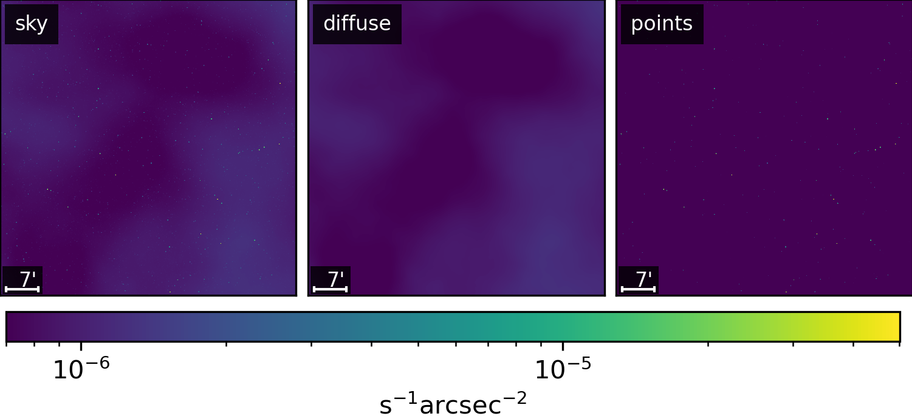
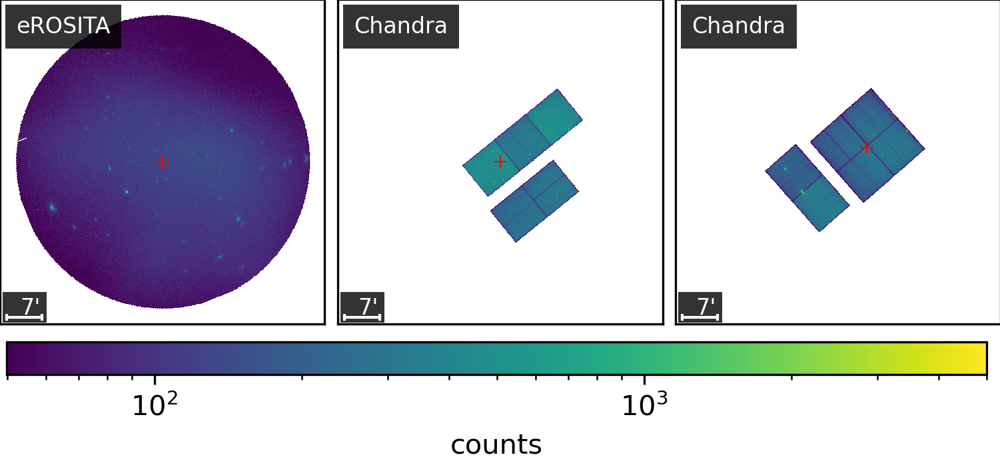

# Summary
Many advances in astronomy and astrophysics originate from accurate images of the sky emission across multiple wavelengths.
This often requires reconstructing spatially and spectrally correlated signals detected from multiple
instruments. To facilitate the high-fidelity imaging of these signals, we introduce the universal Bayesian 
imaging kit (UBIK). Specifically, we present \texttt{J-UBIK}, a flexible and modular implementation leveraging the \texttt{JAX}-accelerated 
\texttt{NIFTy.re} [@Edenhofer:2024] software as its backend.
\texttt{J-UBIK} streamlines the implementation of the key Bayesian inference components, providing for all the necessary steps of Bayesian imaging pipelines. 
First, it provides adaptable prior models for different sky realizations.
Second, it includes likelihood models tailored to specific instruments. So far, the package includes three instruments: Chandra and eROSITA for X-ray observations,
and the James Webb Space Telescope (JWST) for the near- and mid-infrared. The aim is to expand this set in the future.
Third, these models can be integrated with various inference and optimization schemes, such as maximum a posteriori estimation and variational inference.
Explicit demos show how to integrate the individual modules into a full analysis pipeline.
Overall, \texttt{J-UBIK} enables efficient generation of high-fidelity images via Bayesian pipelines that can be tailored to specific research objectives.

# Statement of Need
In astrophysical imaging, we often encounter high-dimensional signals that vary across space, time, and energy. 
The new generation of telescopes in astronomy offers exciting opportunities to capture these signals
but also presents significant challenges in extracting the most information from the resulting data. 
These challenges include accurately modeling the instrument’s response to the signal, 
accounting for complex noise structures, and separating overlapping signals of distinct physical origin.

Here, we introduce \texttt{J-UBIK}, the \texttt{JAX}-accelerated Universal Bayesian Imaging Kit, which leverages 
Bayesian statistics to reconstruct complex signals. In particular, we envision its application in the context of
multi-instrument data in astronomy and also other fields such as medical imaging. 
\texttt{J-UBIK} is built on information field theory (IFT, [@Ensslin:2013]) and the \texttt{NIFTy.re} software package
[@Edenhofer:2024], 
a \texttt{JAX}-accelerated version of \texttt{NIFTy} [Selig:2013; Steininger:2019; @Arras:2019]. 

Following the \texttt{NIFTy} paradigm, \texttt{J-UBIK} employs a generative prior model that encodes assumptions 
about the signal before incorporating any data, and a likelihood model that describes the measurements, 
including the responses of multiple instruments and noise statistics.
Built on \texttt{NIFTy.re}, \texttt{J-UBIK} supports adaptive and distributed representations of high-dimensional
physical signal fields and 
accelerates their inference from observational data using advanced Bayesian algorithms. 
These include maximum a posteriori (MAP), Hamiltonian Monte Carlo (HMC), and two variational
inference techniques: 
metric Gaussian variational inference (MGVI, [@Knollmueller:2020]) and geometric variational
inference (geoVI, [@Frank:2021]). 
As \texttt{NIFTy.re} is fully implemented in \texttt{JAX}, \texttt{J-UBIK} benefits from accelerated inference through
parallel computing on clusters or GPUs.

Building generative models with \texttt{NIFTy.re} for specific instruments and applications can be very
tedious and labor-intensive. Here, \texttt{J-UBIK} comes into play which addresses this challenge from two 
angles. First, it provides tools to simplify the creation of new likelihood and 
prior models and acts as a flexible toolbox. It implements a variety of generic
response functions, such as spatially-varying point-spread functions (PSFs) [@Eberle:2023] and 
enables the user to define diverse correlation structures for various sky components. Second, 
\texttt{J-UBIK} includes implementations for several instruments. 

Currently, it supports Chandra, eROSITA pointings, and JWST observations, with plans to expand this list as the user base grows. 
This expansion will provide users with a diverse set of accessible inference algorithms for various
instruments. Ultimately \texttt{J-UBIK} enables the user, through Bayesian
statistics, not only to obtain posterior samples and hence measures of interest such as the
posterior mean and uncertainty of the signal for a several data sets, but also to
perform multi-instrument reconstructions.

The software has already been applied by @Westerkamp:2023, and publications
on eROSITA pointings and JWST are currently in preparation. In the future, the set of 
instruments will be further expanded to include existing imaging pipelines from \texttt{NIFTy}  
and \texttt{NIFTy.re} such as those described in @Platz:2023, @Roth:2023, @Hutschenreuter:2022,
as well as new ones.

# Bayesian Imaging with \texttt{J-UBIK}
At the core of the \texttt{J-UBIK} package is Bayes’ theorem:

$$ \mathcal{P}(s|d) \propto \mathcal{P}(d|s) \mathcal{P}(s), $$

where the prior $\mathcal{P}(s)$ represents our knowledge about the signal $s$ before 
observing the data $d$, and the likelihood $\mathcal{P}(d|s)$ describes the measurement process. 
The posterior $\mathcal{P}(s|d)$ is the primary measure 
of interest in the inference process.
\texttt{J-UBIK}’s main role is to model the prior in a generative fashion and to facilitate 
the creation and use of instrument models to develop the likelihood model. 
The package includes demos for Chandra, eROSITA pointings, and JWST, which illustrate 
how to use or build these models and how to construct an inference pipeline to obtain 
posterior estimates.

## Prior models
The package includes a prior model for the sky’s brightness distribution across different wavelengths, 
which can be customized to meet user needs in both spatial and spectral dimensions. 
This model allows for the generation of spatially 
uncorrelated point sources or spatially correlated extended sources, as described 
by the correlated field model in [@Arras:2022]. 
In the spectral dimension, the model can be a power law, describe the correlation structure of the logarithmic flux using a Wiener process along the spectral axis or combine both of these models.
The prior model’s structure is designed to be flexible, allowing for modifications to accommodate 
additional dimensions and correlation structures. Figure \ref{fig:sky} illustrates an example of 
a simulated X-ray sky in \texttt{J-UBIK}, 
sampled from a corresponding generative prior model with one energy bin.
This example features two components: 
one representing spatially uncorrelated point sources and the other representing spatially 
correlated extended structures. Figure \ref{fig:sky} shows from left to right the full sky and its
components, the diffuse, extended structures and the point sources.
                                        
| Figure 1: Simulated X-ray Sky\label{fig:sky}       |
|----------------------------------------------------|
|                              |

## Likelihood models
\texttt{J-UBIK} implements several instrument models (Chandra, eROSITA, JWST) and their respective data-
and response-loading
functionalities, enabling their seamless integration into the inference pipeline. Due to its fully
modular structure,
we anticipate the inclusion of more instruments into the \texttt{J-UBIK} platform in the future. \texttt{J-UBIK}
is not only capable of 
reconstructing signals from real data; since each instrument model acts as a digital twin of 
the corresponding 
instrument, it can also be used to generate simulated data by passing sky prior models through
the instrument’s
response. This allows to test the consistency of the implemented models.
                                        
| Figure 2: Simulated X-ray Data\label{fig:data} |
|------------------------------------------------|
|                         |

Figure \ref{fig:data} shows the same simulated sky from Figure \ref{fig:sky} seen by two different instruments, eROSITA and Chandra, 
with Poisson noise on the photon count data. The pointing center for each observation is marked
in red. The two images on the right illustrate the same simulated sky seen by Chandra, but with
different pointing centers, showing the impact of spatially varying PSFs [@Eberle:2023]. 

# Acknowledgements
V. Eberle, M. Guardiani, and M. Westerkamp acknowledge support for this research through
the project Universal Bayesian Imaging Kit (UBIK, Förderkennzeichen 50OO2103) funded
by the Deutsches Zentrum für Luft- und Raumfahrt e.V. (DLR). 
P. Frank acknowledges funding through the German Federal Ministry of Education
and Research for the project “ErUM-IFT: Informationsfeldtheorie für Experi-
mente an Großforschungsanlagen” (Förderkennzeichen: 05D23EO1).
J. Stadler acknowledges support by the Deutsche Forschungsgemeinschaft (DFG, German Research Foundation) 
under Germany’s Excellence Strategy – EXC-2094 – 390783311.

# References

